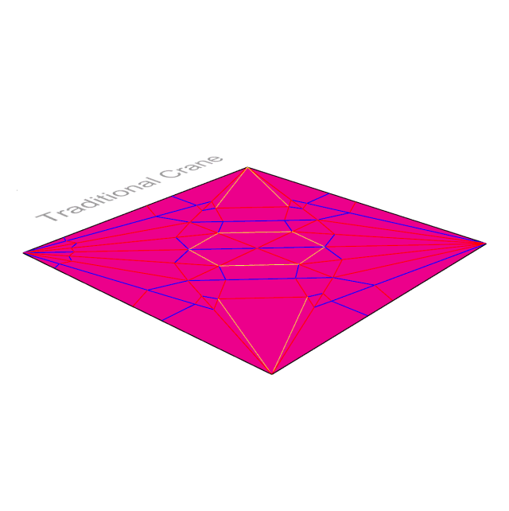

# Grasshopper Origami Simulator

A Grasshopper (Rhino 8) port of [Origami Simulator](https://github.com/amandaghassaei/OrigamiSimulator) ([origamisimulator.org](https://origamisimulator.org/)). It folds a crease pattern drawn on Rhino layers, colours it by strain, and exports a printable model. A second version runs the same physics as Kangaroo2 goals.

## Contents

| Path | What it is |
|---|---|
| [`grasshopper/OrigamiSim.gh`](grasshopper/OrigamiSim.gh) | Main definition: solver, strain colours, 3D Print export. |
| [`grasshopper/OrigamiSim_Kangaroo.gh`](grasshopper/OrigamiSim_Kangaroo.gh) | Kangaroo2 version. |
| `grasshopper/*.cs` | Source of the script components, for reading and diffing. |
| [`grasshopper/examples/`](grasshopper/examples/) | `OrigamiExamples.3dm` with 10 ready-to-fold patterns, plus the scripts that built it. |

## Getting started

1. Open `grasshopper/examples/OrigamiExamples.3dm` in Rhino 8.
2. Open `grasshopper/OrigamiSim.gh` in Grasshopper.
3. Hide every pattern except the one to fold, then drag **Fold**.

Full instructions, inputs, constants and troubleshooting: [`grasshopper/README.md`](grasshopper/README.md). Pattern list and layers: [`grasshopper/examples/README.md`](grasshopper/examples/README.md).

## Credits

The physics follows the original web app by [Amanda Ghassaei](http://www.amandaghassaei.com/), with Erik Demaine, Sasaki Kosuke and [other contributors](https://github.com/amandaghassaei/OrigamiSimulator/graphs/contributors), described in [*Fast, Interactive Origami Simulation using GPU Computation*](http://erikdemaine.org/papers/OrigamiSimulator_Origami7/) (Ghassaei, Demaine, Gershenfeld, 7OSME). That solver builds on:

- [Origami Folding: A Structural Engineering Approach](http://www3.eng.cam.ac.uk/~sdg/preprint/5OSME.pdf) — Mark Schenk and Simon D. Guest
- [Freeform Variations of Origami](http://www.tsg.ne.jp/TT/cg/TachiFreeformOrigami2010.pdf) — Tomohiro Tachi

The 3D Print group's layered hinge-and-panel design is inspired by [Ready-to-Fold Origami Sheets](https://www.thingiverse.com/thing:5468514) by Darknight35 on Thingiverse.
The example crease patterns come from the original repo's [`assets/`](https://github.com/amandaghassaei/OrigamiSimulator/tree/7855983a613c879c171b2b1557f8cd102d2640cf/assets) folder.

## License

MIT — see [`LICENSE`](LICENSE).
