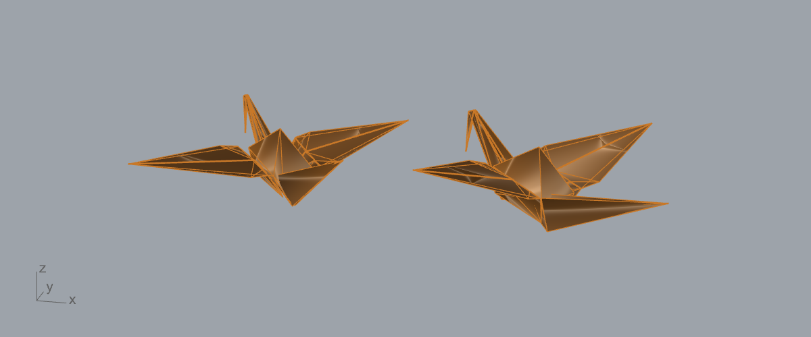
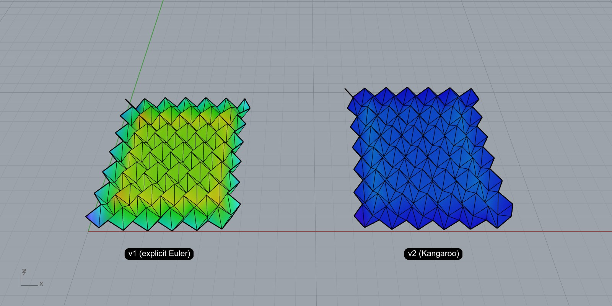
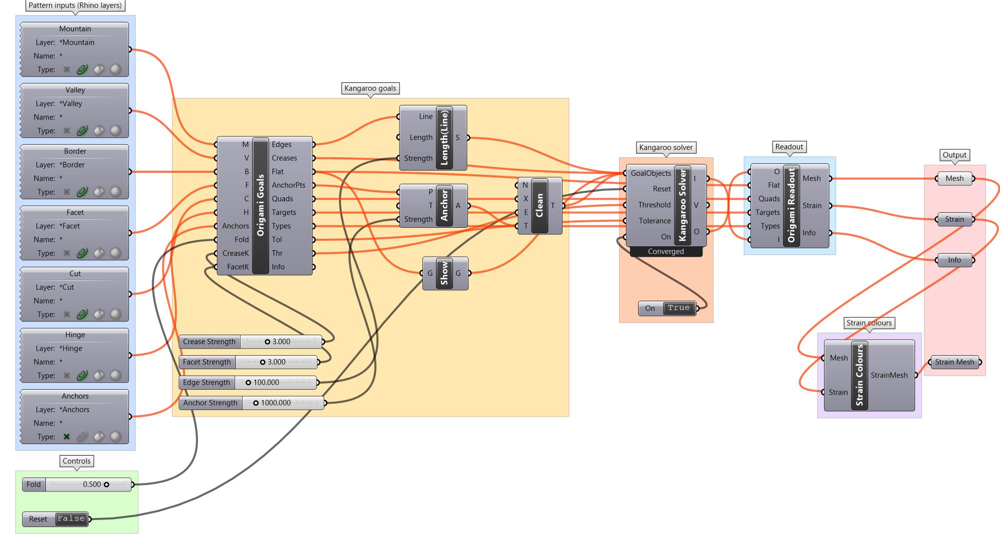

# Origami Simulator for Grasshopper

A Grasshopper (Rhino 8) definition that folds a crease pattern the way [origamisimulator.org](https://origamisimulator.org/) does. It is a CPU port of the dynamic solver from [Origami Simulator](https://github.com/amandaghassaei/OrigamiSimulator), described in *Fast, Interactive Origami Simulation using GPU Computation* (Ghassaei, Demaine, Gershenfeld, 7OSME).

Every vertex is a particle with mass 1. Every edge is a stiff spring (a "beam"). Every crease is an angular spring that pulls the fold angle toward `target × Fold`. Every triangle has springs that keep its corner angles flat. Each solve runs 100 explicit-Euler steps with the same time step rule as the web app.

## Files

| File | What it is |
|---|---|
| `OrigamiSim.gh` | The definition. Open this. |
| `OrigamiSolver.cs` | The solver source that lives inside the Origami Solver component, kept here so it can be read and diffed. |
| `StrainColour.cs` | The source of the Strain Colours component. |
| `OrigamiPrint.cs` | The source of the Origami Print component (the 3D Print group). |
| `OrigamiSim_Kangaroo.gh` | The Kangaroo2 version of the definition. See [Kangaroo version](#kangaroo-version). |
| `OrigamiKangaroo.cs`, `OrigamiKangarooReadout.cs` | The sources of its Origami Goals and Origami Readout components. |
| `examples/stl_groove_lines.py`, `examples/crane_print_reference.json` | Recover crease lines from a printable-origami STL; the crane reference used to check the 3D Print output. |

## Open and run

1. Open `OrigamiSim.gh` in Grasshopper (Rhino 8).
2. If the crease layers are empty or missing, the solver uses a built-in Miura-ori demo.
3. The **Animate** timer is disabled when the file opens. Select it and press `Ctrl+E` (or right-click it and choose *Enable*) to run the simulation continuously. Disable it again to stop.
4. Drag **Fold**: 0 is flat, 1 is fully folded, −1 is fully folded with mountains and valleys swapped.
5. Set **Reset** to true to snap back to the flat sheet; set it to false to fold again.

Without the timer, each change to an input runs one solve of 100 steps.

## Use your own crease pattern

The definition reads the crease pattern straight from Rhino layers. Anything on these layers is picked up automatically and updates live as you draw, move or delete it. The line types follow the web app's SVG import ([`js/pattern.js`](https://github.com/amandaghassaei/OrigamiSimulator/blob/7855983a613c879c171b2b1557f8cd102d2640cf/js/pattern.js)).

| Layer | Solver input | What it does in the simulation |
|---|---|---|
| `Border` | B | The outer edge of the paper. |
| `Mountain` | M | Folds toward −180° at Fold = 1, or toward −`TargetAngleDeg` (see below). |
| `Valley` | V | Folds toward +180° at Fold = 1, or toward +`TargetAngleDeg`. |
| `Facet` | F | Flat crease: held at 0° with the facet stiffness. Use it to split faces into triangles your way. |
| `Cut` | C | The paper is cut along the line. The two sides become separate edges; the end of a slit inside the sheet stays connected. |
| `Hinge` | H | An edge with no fold spring: the panels on either side rotate freely. |
| `Labels` | — | Ignored. |
| `Anchors` (optional) | Anchors | Points on vertices that should stay still. |

1. Draw the pattern on these layers. Keep it planar. Endpoints closer than 0.5 % of the pattern's radius (or the document tolerance, if that is larger) are merged, as the web app merges points within 3 px. Crossings and T-junctions are split automatically.
2. Layers can be top level or nested, for example `Origami::Mountain`: the filters are `*Mountain`, `*Valley` and so on, so any layer whose full path ends in that name is used. Avoid other layers ending in those words.
3. Polylines and rectangles are split into their straight segments. Curved segments are approximated by short straight lines, and the solver shows a warning, because curved creases are not simulated.
4. Hidden objects are ignored; locked objects are included. To change a layer name, double-click its pipeline in the **Pattern inputs** group and edit the layer filter.
5. If two lines overlap, the stronger type wins: Cut, then Mountain/Valley, then Facet, then Hinge, then Border. A Border line inside the sheet acts as a hinge, as in the web app.

With every crease layer empty, the solver falls back to the built-in demo.

Faces with more than three sides are triangulated, and the added diagonals act as Facet creases, as in the web app. Lines that dangle (end without meeting anything) are ignored.

**Partial folds.** In the web app a crease's stroke opacity sets how far it folds: opacity × 180°. Here, give the Mountain or Valley line a User Text entry `TargetAngleDeg` with a value from 0 to 180 (Properties panel → Attribute User Text, or the `SetUserText` command). At Fold = 1 the crease folds to that angle; lines without it fold to 180°. The example patterns already carry it. Patterns such as the crane need it: forcing their 45° and 135° creases to 180° asks for a shape that cannot exist, and the sheet tangles. The value is read through the layer pipelines on every solve, so an edit takes effect the next time the solver runs (move Fold, or run the Animate timer). Curves wired in some other way, for example internalised in a parameter, have no Rhino object to read from and fold to 180°.

**Scale.** Before simulating, the solver centres the pattern and scales it to a radius of 1, as the web app does ([`js/model.js`](https://github.com/amandaghassaei/OrigamiSimulator/blob/7855983a613c879c171b2b1557f8cd102d2640cf/js/model.js)). The Mesh output is scaled back to model units. Without this, the balance between edge, face and crease springs would change with the drawing units, and the same pattern would fold differently at 1 unit and at 100.

## Constants

The stiffness settings are constants at the top of the `OrigamiSim` class inside the C# component. Double-click the component to edit them.

| Constant | Default | Web app slider | Range there | Effect |
|---|---|---|---|---|
| `AXIAL` | 20 | Axial Stiffness | 10–100 | Edge stretch resistance. Higher is stiffer but forces a smaller time step. |
| `CREASE` | 0.7 | Fold Stiffness | 0–3 | Strength of mountain and valley creases. |
| `FACET` | 0.7 | Facet Crease Stiffness | 0–3 | How strongly facets resist bending. |
| `FACE` | 0.2 | Face Stiffness | 0–5 | How strongly triangles keep their corner angles. |
| `DAMP` | 0.45 | Damping | 0.01–0.5 | Damping ratio of the edge springs. |
| `STEPS` | 100 | (fixed) | | Solver steps per solve. |
| `TARGET_DEG` | 180 | (per line opacity) | | Fold angle at Fold = 1 for lines without `TargetAngleDeg`. |
| `MERGE_REL` | 0.005 | Vertex Merge Tolerance (3 px) | | Points closer than this × the pattern radius are merged. Never less than the document tolerance. |
| `DEMO_WHEN_EMPTY` | 2 | | | Demo used when M, V and B are empty: 0 none, 1 single valley, 2 Miura 4×4, 3 Miura 12×12. |

## Reading the output

- **Mesh** is the plain folded mesh. Its preview is on when the file opens.
- **Strain Mesh** is a copy coloured by axial strain: blue is 0 %, red is 5 % or more. It comes from the separate **Strain Colours** component. Its preview is off when the file opens, because the two meshes sit in the same place. Select a parameter and press `Ctrl+Q` (or right-click it and choose *Preview*) to switch between them.
- **Strain** lists each vertex's strain in percent.
- **Info** reports counts and solver state:

| Field | Meaning |
|---|---|
| `dt` | Time step, `0.9 / (2π · ω_max)` over all edges. |
| `frame`, `steps` | Solves and total steps since the last rebuild. |
| `msPerSolve` | Time spent in the last solve. |
| `meanStrain%` | Average vertex strain. |
| `maxThetaErrDeg`, `meanThetaErrDeg` | Largest and average gap between a mountain/valley crease's angle and its current target. Patterns like the crane cannot meet every target at once: the web app's crane ends with about 87° largest and 11° average, and so does this solver. |
| `mvSenseOk` | Mountain/valley creases bending the right way, out of the total. |
| `meanAbsV` | Average vertex speed. Near zero means the model has settled. |
| `finite` | False if the simulation blew up. |
| `targets` | Mountain/valley creases per target angle at Fold = 1, mountains negative, for example `-180x50,45x8`. Use it to check that `TargetAngleDeg` was read. |

## 3D print

The **3D Print** group turns the same crease layers into a flat, printable sheet of the unfolded pattern. Its structure copies a crane STL that printed and folded well:

- a **hinge layer** over the whole sheet, from z 0 to the Hinge Thickness. This thin layer is what bends;
- a **panel layer** on top of it, up to the Total Height, with a 1.2 mm gap centred on every Mountain, Valley and Hinge line;
- **through-holes** (Ø 5 mm) at crowded vertices.

The bottom is flat, so it prints on the bed with the grooves facing up.

| Slider | Default | What it does |
|---|---|---|
| Size | 158 | Length in mm of the sheet's longest side. The pattern is scaled to fit, so you can draw it at any size. |
| Total Height | 0.3 | Overall thickness in mm. |
| Hinge Thickness | 0.2 | Thickness of the hinge layer in mm. The panels are Total Height − Hinge Thickness. It must be smaller than Total Height. |
| Hole Degree | 6 | A hole goes at every interior vertex where at least this many grooved or cut lines meet. Raise it for fewer holes. |

What each layer becomes:

| Layer | Print |
|---|---|
| Mountain, Valley, Hinge | A 1.2 mm groove in the panel layer. All grooves are on the top face. |
| Cut | A 1.2 mm slot through the whole sheet. |
| Facet | Nothing: facets never fold, so they stay solid. |
| Border | The outline. A Border line inside the sheet stays solid. |

Constants at the top of `OrigamiPrint` (double-click the component): `GROOVE` 1.2 mm, `HOLE_D` 5 mm, `HOLE_SEGS` 48 sides per hole, `EPS` 0.01 mm. `EPS` is a clearance that keeps the panels just inside the outline, the holes and the slots, so the mesh can be built as one closed shell. It is far below what a slicer resolves.

**Line ends that nearly meet** are joined the same way as in the solver: ends closer than `MERGE_REL` (0.005) × the pattern's radius, or the document tolerance if that is larger, become one vertex. The distance is relative to the pattern, so it does not change with Size, and it only decides which ends meet. Grooves, holes and the outline keep their own sizes. Patterns traced from SVGs often miss by a few hundredths of a unit; the example crane misses by up to 0.045 on a 100-unit sheet, and without this its print came out as 4 separate open shells.

**Printing it:** select **Print Mesh**, right-click and choose *Bake*. Then `_Export` it as STL with units set to millimetres. The mesh is in millimetres and placed to the right of the pattern. If the Rhino document is not in millimetres, the component warns you, because the numbers are millimetres regardless.

**Print Info** reports:
- the scale, `mergeTol` (the joining distance above, in mm) and the panel count;
- `insetFallbacks` and `facesDropped`: faces smaller than 1.2 × 1.2 mm after grooving get no panel;
- the hole count;
- whether the mesh is closed and manifold, plus how many small triangulation repairs were made;
- the volume, and the time per stage;
- `foldLimitDeg = 2·atan(1.2 / (2 × panel height))`: when a groove closes on the inside of a fold, its panel walls touch at this angle. Beyond it the hinge has to stretch. It is 161° at the default 0.1 mm panels and about 100° at 0.5 mm. If you raise Total Height a lot, expect stiffer folds.

**About the holes:** the reference crane has holes at its centre and at the 4 bird-base points. The bird-base points have 4 creases, the same as several unholed crossings in that pattern, so no degree threshold reproduces it exactly. At the default of 6, the crane gets only the centre hole; at 4 it gets 14.

With every crease layer empty, the group shows the same Miura demo as the solver.

## Kangaroo version

`OrigamiSim_Kangaroo.gh` folds the same crease layers with [Kangaroo2](https://www.food4rhino.com/en/app/kangaroo-physics), which ships with Rhino 8. It reads the same layers, Anchors, Fold and Reset as the main definition, and its Output and Strain colours groups work the same way. The 3D Print group is not included. The main definition is unchanged.

Kangaroo has no masses, time step or damping. Every constraint is a *goal*, a position the points would like to be in. The Solver moves each point to a weighted average of what its goals ask for, and repeats until the points stop moving.

| Group | What it does |
|---|---|
| Kangaroo goals | **Origami Goals** builds the same triangle mesh as the main solver. It outputs one *OrigamiCrease* goal per crease and one *OrigamiCorner* goal per triangle corner, which holds the corner at its flat angle. Every mesh edge goes to Kangaroo's **Length(Line)** goal with its own strength (**EdgeW**), which keeps the panels rigid. Anchors go to Kangaroo's **Anchor** goal, then through **Clean Tree**, because Anchor sends out an empty goal when there are no anchor points and the Solver fails on it. **Show** carries the mesh through the Solver so it comes out folded. |
| Kangaroo solver | Kangaroo's **Solver**. **On** = true keeps it iterating, so the model animates by itself and no timer is needed. Reset rebuilds it flat. |
| Readout | Takes the folded mesh out of the Solver. It measures strain and every fold angle from the geometry, the same way the main solver does. |

**Why creases are a custom goal.** Kangaroo's own Hinge goal measures the angle between −180° and 180°. When a crease nears a full fold, the Solver overshoots past 180°, the angle jumps to about −180° and the Hinge pushes the wrong way. In tests it flipped or stalled anywhere above about 150–165°. OrigamiCrease measures the angle with the web app's formula, inside a window on its own mountain or valley side. It moves the four points the way the web app's crease forces do. Those moves have no net force or twist, so a sheet whose creases can't all reach their targets settles instead of spinning. Edges, anchors, display and the Solver are stock Kangaroo.

**Why the goal weights copy the web app.** A Kangaroo goal that asks to correct an error *r* by the smallest move, with weight *w*, behaves like a spring of stiffness *w* / |∇*r*|² on *r*. So Origami Goals sets every weight to the web app's stiffness × |∇*r*|²:
- edges: `AXIAL / L0`, so short edges are stiffer;
- creases: `CREASE` or `FACET` × crease length;
- triangle corners: `FACE`.

Kangaroo then settles where the main solver does. Each crease goal may ask for up to ±180° per iteration (`MAXROT_DEG` = 90).

Earlier versions used plain weights and a ±30° cap, and the Traditional Crane folded into a tangle: 84 of 111 mountain/valley creases ended on the right side, and facets bent 162°. Plain weights let a crease's real stiffness grow with the square of its panels' width, so creases next to narrow panels went limp. The cap made a crease 150° from its target pull no harder than one 30° away. Tested one at a time, the crane still tangles without any of these three:
- the crease weights;
- the corner goals;
- the wider cap.

The per-edge Length strengths bring its average crease error from 12.5° to 11.1°, within 10 % of the web app's.

| Slider | Default | What it does |
|---|---|---|
| Crease Strength | 1 | Mountain/valley crease stiffness, × the web app's `CREASE` (0.7). |
| Facet Strength | 1 | Flat-crease stiffness (Facet lines and triangulation diagonals), × the web app's `FACET` (0.7). |
| Edge Strength | 100 | Average weight of the Length goals. Higher means less stretch. At 100, edges, creases and corners balance as in the web app. |
| Anchor Strength | 1000 | Weight of the Anchor goals. |

Only the ratios between strengths matter. Raising Crease Strength, or lowering Edge Strength, lets the sheet stretch more mid-fold. The corner goals' stiffness is fixed at the web app's `FACE` (0.2). Origami Goals' Info echoes `creaseK`, `facetK` and `edgeK`.

**Readout Info** reports `iterations`, `meanStrain%`, `maxStrain%`, `maxThetaErrDeg` (mountain/valley creases), `maxFacetDeg` (bending of flat creases), `mvSenseOk` and `finite`. `mvSenseOk` counts mountain/valley creases on their own side and not folded more than 5° past flat-folded; a crease that swings to the wrong side or folds through itself fails it. `settled=true` means every mountain/valley crease is within 0.5° of its target. Partway through a fold, a pattern like the Miura cannot meet every target at once, so it can be still while `settled` is false.

### Compared with the main definition

Each case starts flat. "Settle" means no point moves more than 1e-6 × the sheet diagonal during one Solver pass. D is the largest difference, over all pairs of vertices, between their distances in the two results. It needs no alignment, and it is 0 when the shapes are identical.

| Pattern | Fold | D (% of diagonal) | Main settle | Kangaroo settle | Main strain | Kangaroo strain |
|---|---|---|---|---|---|---|
| Single crease | 0.5 | 0 % | 109 ms | 53 ms | 0 % | 0 % |
| Single crease | 1 | 0 % | 122 ms | 141 ms | 0 % | 0 % |
| Miura 4×4 | 0.5 | 2.5 % | 0.81 s | 0.18 s | 1.82 % | 1.18 % |
| Miura 4×4 | 1 | 0 % | 0.97 s | 0.12 s | 0 % | 0 % |
| Miura 12×12 | 0.5 | 1.8 % | 7.6 s | 0.51 s | 2.03 % | 1.44 % |
| Miura 12×12 | 1 | 0.004 % | 5.0 s | 0.54 s | 0 % | 0 % |

When every crease can reach its target (a single crease, or any full fold), both give the same shape. Partway through a Miura fold they differ by about 2 % of the sheet size, and Kangaroo stretches a little less. On the Miura, Kangaroo settles 4–15 times faster; a single crease takes about as long in both.

The Traditional Crane at Fold 1, ramped from flat in 50 steps, matches too. After a rigid alignment the two cranes differ by 1.4 % of the diagonal (RMS). Kangaroo's largest and average crease errors are 90.4° and 11.1°, against 86.6° and 10.9° for the main solver and 87.1° and 10.9° for the web app.

The Miura picture below was taken with the earlier goal weights, when the two differed by about 7 % mid-fold.

**Behaviour to expect:**
- A free sheet that is unfolded back to Fold 0 is flat but may be tilted in space, because nothing holds it in place. Toggle Reset, or add an anchor.
- Unfolding a pattern from a full fold back to flat takes longer (about 1.6 s on Miura 12×12), because fully folded creases start with no leverage.
- The Kangaroo Solver merges points closer than its Tolerance, so the builder moves the extra vertex at each cut 0.1 × the document tolerance into its own panel. That keeps the two sides of a cut apart.
- **The crane's `mvSenseOk` reads 93/111, not 111/111, although it is folded correctly.** The other 18 creases fold up to 17° past flat-folded, which the Readout counts as folding through itself (more than 5°). The main solver's crane gives 95/111 under the same rule. Its own Info reports 111/111, because it only checks the side. Fold the crane gradually, as in the web app.

## Troubleshooting

- **The mesh explodes or `finite=false`.** Toggle Reset. Then lower `AXIAL` or `CREASE`, or raise `DAMP`.
- **Nothing folds or `build failed: no closed faces`.** Lines probably do not meet, or the Border is missing. Check them with `_Intersect` or by raising the document tolerance.
- **My pattern is ignored and the demo shows.** Check the layer names (`Border`, `Mountain`, `Valley`, `Facet`, `Cut`, `Hinge`) and that the objects are not hidden.
- **It folds the wrong way.** Swap the M and V inputs, or set Fold negative.
- **A pattern that folds in the web app tangles here.** Check that its partial folds carry `TargetAngleDeg` (the `targets` field in Info lists the angles that were read), and fold it gradually: the web app's crane also tangles if Fold jumps straight from 0 to 1.
- **Print Info says the mesh is not closed.** Look for lines that cross or overlap without meeting, or for gaps larger than `mergeTol` (Print Info). Close those gaps in the drawing; raising the document tolerance also joins them.
- **It is slow.** Solve time grows with vertex count. Patterns with thousands of vertices run, but slowly.
- **The solver component is orange.** It shows warning CS1701, a harmless .NET assembly-version notice from Rhino 8. Wires from the layer pipelines are orange while those layers are empty.

## How it was built

The canvas was assembled headlessly through the Rhino MCP (`g1_*` tools for placement and wiring; `run_csharp` for the script code, groups and save). The 3D Print group was added the same way, and the Kangaroo version was built the same way, starting from a copy of this definition.
